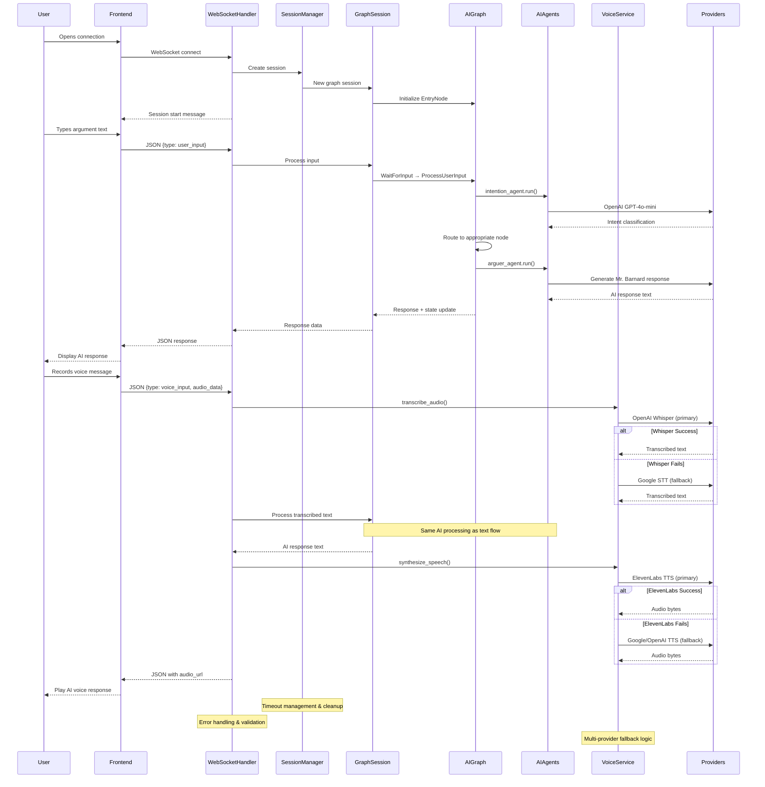
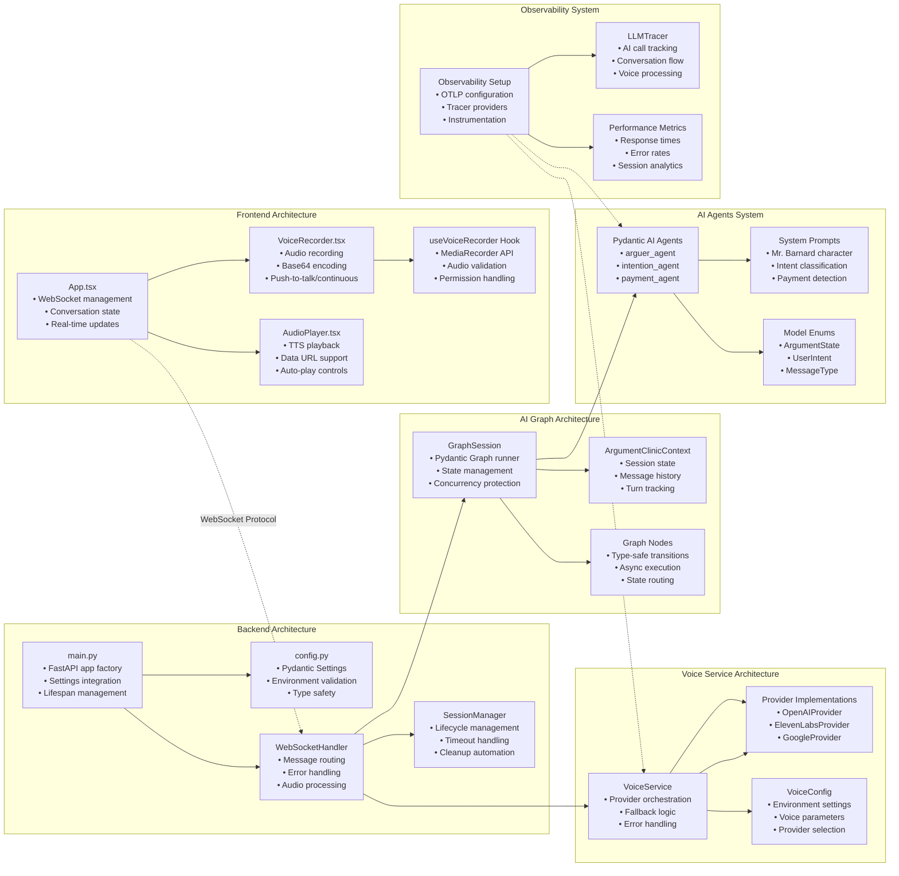

# Argument Clinic System Architecture

## System Overview Diagram

```mermaid
graph TB
    %% Frontend Layer
    subgraph "Frontend (React + TypeScript)"
        UI[App.tsx - Main UI]
        VR[VoiceRecorder.tsx]
        AP[AudioPlayer.tsx]
        VH[useVoiceRecorder Hook]
        UI --> VR
        UI --> AP
        VR --> VH
    end

    %% WebSocket API Layer
    subgraph "API Layer (FastAPI + WebSocket)"
        MAIN[main.py - FastAPI App]
        WS[routes/websocket.py]
        WSHANDLER[WebSocketHandler]
        SESSMGR[SessionManager]
        CONFIG[config.py - Settings]
        MAIN --> WS
        WS --> WSHANDLER
        WS --> SESSMGR
        MAIN --> CONFIG
    end

    %% Backend Services
    subgraph "Backend Services"
        ARGSVC[argument_clinic_graph.py - AI Graph]
        VOICESVC[voice_service.py - Multi-Provider Voice]
        PROVIDERS[VoiceProvider Classes]
        MODELS[models/argument.py - Data Models]
        PERF[performance.py - Metrics]
        WS --> ARGSVC
        WS --> VOICESVC
        VOICESVC --> PROVIDERS
        ARGSVC --> MODELS
        WS --> PERF
    end

    %% AI State Machine (Pydantic Graph)
    subgraph "AI State Machine (Pydantic AI Graph)"
        direction TB
        ENTRY[EntryNode - Welcome]
        WAIT[WaitForInput - Session Pause]
        PROCESS[ProcessUserInput - Intent & Routing]
        SIMPLE[SimpleContradictionNode]
        ARG[ArgumentationNode]
        META[MetaCommentaryNode]
        RES[ResolutionNode - Payment]
        
        ENTRY --> WAIT
        WAIT --> PROCESS
        PROCESS --> SIMPLE
        PROCESS --> ARG
        PROCESS --> META
        PROCESS --> RES
        SIMPLE --> WAIT
        ARG --> WAIT
        META --> WAIT
        RES --> WAIT
        RES --> SIMPLE
    end

    %% AI Agents
    subgraph "AI Agents (Pydantic AI)"
        ARGUER[arguer_agent - Mr. Barnard Responses]
        INTENT[intention_agent - Intent Classification]
        PAYMENT[payment_agent - Payment Detection]
        ARGSVC --> ARGUER
        ARGSVC --> INTENT
        ARGSVC --> PAYMENT
    end

    %% External AI Services
    subgraph "LLM Providers"
        OPENAI[OpenAI GPT-4o-mini]
        ANTHROPIC[Anthropic Claude]
        GOOGLE[Google Gemini]
        ARGUER --> OPENAI
        INTENT --> OPENAI
        PAYMENT --> OPENAI
    end

    %% Voice Provider Architecture
    subgraph "Voice Provider System"
        subgraph "STT Providers"
            OPENAI_STT[OpenAI Whisper]
            GOOGLE_STT[Google Speech-to-Text]
        end
        subgraph "TTS Providers"
            ELEVEN[ElevenLabs TTS]
            GOOGLE_TTS[Google TTS]
            OPENAI_TTS[OpenAI TTS]
        end
        PROVIDERS --> OPENAI_STT
        PROVIDERS --> GOOGLE_STT
        PROVIDERS --> ELEVEN
        PROVIDERS --> GOOGLE_TTS
        PROVIDERS --> OPENAI_TTS
    end

    %% Observability & Monitoring
    subgraph "Observability (Modern OTLP)"
        OBS[core/observability.py - Tracing Setup]
        JAEGER[Jaeger UI]
        OTEL[OpenTelemetry SDK]
        LLMTRACER[LLMTracer - AI Call Tracing]
        MAIN --> OBS
        OBS --> OTEL
        OTEL --> JAEGER
        OBS --> LLMTRACER
    end

    %% Data Flow Arrows
    UI -- "WebSocket JSON/Text/Audio" --> WSHANDLER
    VR -- "Audio (base64)" --> WSHANDLER
    WSHANDLER -- "AI Response + Audio URL" --> AP

    %% External connections
    LLMTRACER -.->|Distributed Tracing| OPENAI
    LLMTRACER -.->|Distributed Tracing| ELEVEN

    %% Styling
    classDef frontend fill:#e1f5fe,stroke:#01579b,stroke-width:2px
    classDef backend fill:#f3e5f5,stroke:#4a148c,stroke-width:2px
    classDef ai fill:#fff3e0,stroke:#e65100,stroke-width:2px
    classDef voice fill:#e8f5e8,stroke:#1b5e20,stroke-width:2px
    classDef external fill:#ffebee,stroke:#c62828,stroke-width:2px
    classDef monitoring fill:#f1f8e9,stroke:#33691e,stroke-width:2px
    
    class UI,VR,AP,VH frontend
    class MAIN,WS,WSHANDLER,SESSMGR,CONFIG,ARGSVC,VOICESVC,PROVIDERS,MODELS,PERF backend
    class ARGUER,INTENT,PAYMENT,ENTRY,WAIT,PROCESS,SIMPLE,ARG,META,RES ai
    class OPENAI_STT,GOOGLE_STT,ELEVEN,GOOGLE_TTS,OPENAI_TTS voice
    class OPENAI,ANTHROPIC,GOOGLE external
    class OBS,JAEGER,OTEL,LLMTRACER monitoring
```

## Refactored Data Flow Diagram

## Component Architecture Diagram

## Technology Stack Overview

```mermaid
graph TB
    subgraph "Frontend Stack"
        REACT[React 19<br/>• Modern Hooks & Suspense<br/>• WebSocket integration]
        TS[TypeScript<br/>• Full type safety<br/>• Interface definitions]
        TAILWIND[Tailwind CSS + DaisyUI<br/>• Utility-first styling<br/>• Component library]
        VITE[Vite<br/>• Fast dev server<br/>• HMR support]
        REACT --> TS
        TS --> TAILWIND
        TAILWIND --> VITE
    end
    
    subgraph "Backend Stack"
        FASTAPI[FastAPI<br/>• Async WebSocket support<br/>• Auto-generated docs]
        PYDANTIC_AI[Pydantic AI<br/>• Type-safe AI agents<br/>• Structured outputs]
        PYDANTIC_GRAPH[Pydantic Graph<br/>• State machine framework<br/>• Type-safe transitions]
        UVICORN[Uvicorn<br/>• ASGI server<br/>• WebSocket support]
        FASTAPI --> PYDANTIC_AI
        PYDANTIC_AI --> PYDANTIC_GRAPH
        FASTAPI --> UVICORN
    end
    
    subgraph "AI & Voice Stack"
        OPENAI_SDK[OpenAI Python SDK<br/>• GPT-4o-mini<br/>• Whisper STT<br/>• TTS-1]
        ELEVENLABS_SDK[ElevenLabs SDK<br/>• High-quality TTS<br/>• Voice cloning]
        GOOGLE_CLOUD[Google Cloud SDKs<br/>• Speech-to-Text<br/>• Text-to-Speech]
        ANTHROPIC_SDK[Anthropic SDK<br/>• Claude models]
        OPENAI_SDK --> ELEVENLABS_SDK
        ELEVENLABS_SDK --> GOOGLE_CLOUD
        GOOGLE_CLOUD --> ANTHROPIC_SDK
    end
    
    subgraph "Observability Stack"
        OTEL_SDK[OpenTelemetry SDK<br/>• Distributed tracing<br/>• Metrics collection]
        JAEGER[Jaeger<br/>• Trace visualization<br/>• Performance analysis]
        OTLP[OTLP Exporter<br/>• Modern protocol<br/>• Cloud-native]
        OTEL_SDK --> OTLP
        OTLP --> JAEGER
    end
    
    subgraph "Development Tools"
        UV[uv<br/>• Fast package management<br/>• Virtual environments]
        RUFF[Ruff<br/>• Fast linting & formatting<br/>• Python code quality]
        MYPY[MyPy<br/>• Static type checking<br/>• Runtime safety]
        PYDANTIC_SETTINGS[Pydantic Settings<br/>• Environment validation<br/>• Type-safe config]
        UV --> RUFF
        RUFF --> MYPY
        MYPY --> PYDANTIC_SETTINGS
    end
```

**Key Architecture Decisions**

1. **WebSocket-First Architecture**: All conversation flows through WebSocket with proper session management
2. **Provider Pattern for Voice**: Multi-provider fallback with clean abstraction layer
3. **Type-Safe State Machine**: Pydantic Graph with compile-time state transition validation
4. **AI Agent Orchestration**: Specialized agents for different conversation aspects
5. **Modern Observability**: OTLP-based tracing with comprehensive AI operation monitoring
6. **Configuration Management**: Pydantic Settings with full environment integration
7. **Separation of Concerns**: Clean boundaries between WebSocket handling, AI processing, and voice services
8. **Error Resilience**: Graceful fallbacks across all external service dependencies
